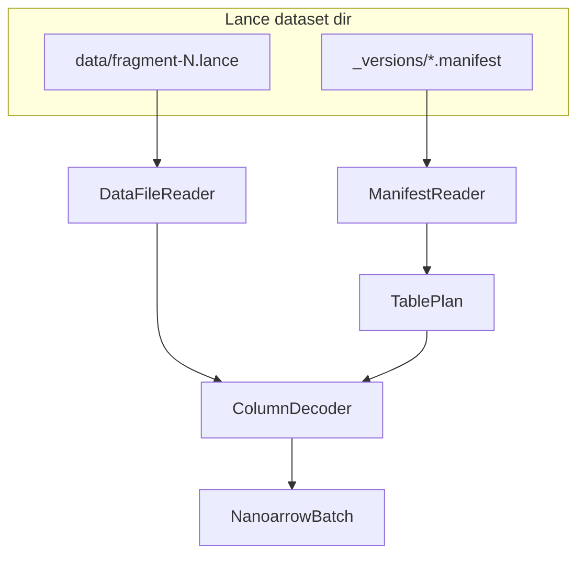

# Plan: native Lance table reader (`nano_lance_reader` + nanoarrow)

Goal: read `header.lance` / `entries.lance` (and sidecars) **without Python `lance`**, so tools like **Mdf2Lance** use only `--lance-dir`.

## Core policy: writer parity only

**Only decode what `nano_lance_writer` / `data_file_writer.cpp` already writes today.**

- No generic “full Lance” reader.
- No support for encodings, column types, or manifest options we do not emit.
- If a file uses an unsupported layout → **clear error** (not best-effort).
- When we add a new write feature later, implement the **matching read path in the same change** (or immediately after in the same PR series).

This keeps the reader small and guarantees round-trip tests against our own writer.

## Supported on-disk subset (v1 reader)

Matches current writer output (Sdx2Lance / `arrowipc2lance` with `--ignore-nullability`):

| Area | Supported |
|------|-----------|
| Dataset layout | `_versions/N.manifest` + `data/fragment-*.lance` (Lance **2.2**, file version **2.2**) |
| Manifest | Fields produced by `manifest_writer` (logical types, metadata map, fragment list) |
| Data file footer | Layout from `data_file_reader` (descriptor + column metadata offset table) |
| Fixed-width columns | `lance_on_disk_field_encoding` = 1; zstd miniblocks; one `ColumnPage` per miniblock chunk; `PageLayout` from `column_encoding_bytes()` |
| Variable-width (`string` / utf8) | Encoding 2; int32 offsets (large_utf8 not used by Sdx2Lance today) |
| Blob v2 external packed | Single physical column; raw payload + control buffer; `blob_v2_page_layout_encoding()` pages |
| Nullability | **Non-null only** (same as typical writer ingest with `ignore_nullability`) |
| Arrow extension | `lance.blob.v2` on ingest struct; on disk manifest uses materialized children — reader exposes **write-side Arrow shape** for `payload_ref` (`data`/`uri`/`position`/`size`) when reading `entries.lance` |

## Explicitly out of scope until writer supports them

Do **not** implement readers for:

- Dictionary columns, nullable validity bitmaps (unless writer starts emitting them)
- IPC2Lance / `lance-c` datasets or encodings we do not produce
- Arbitrary third-party Lance files
- Column types beyond those in `schema_mapper` + blob v2 path
- In-place update / append-on-read
- Full SQL / random row access

Add each item here only when the **writer** gains the feature.

## Other principles

- **nanoarrow only** at the public boundary (`ArrowSchema` / `ArrowArray` / optional `ArrowArrayStream`).
- Reuse **manifest** + **data-file footer** code (`manifest_reader`, `data_file_reader`, `lance_minimal.pb`).
- **Read path inverts `data_file_writer.cpp`** for the supported subset only.
- Tests: always **writer → reader** round-trip on the same tree (no golden files from Python Lance unless cross-check optional).

## Architecture

### Core types (C++ / optional C API)

| Component | Responsibility |
|-----------|----------------|
| `LanceTablePlan` | Dataset path + manifest fields + fragment list + column index map |
| `LanceColumnDecoder` | One physical column: load pages from `.lance`, decompress, emit Arrow array (**writer encodings only**) |
| `LanceTableReader` | Iterates fragments/rows; builds struct arrays for supported schemas |
| C wrappers | `nano_lance_table_open`, `nano_lance_table_read_schema`, `nano_lance_table_read_next_batch` |

## Phase 1 — Infrastructure (1–2 PRs)

1. **Extend `data_file_reader`**
   - Load column metadata blobs at `column_metadata_start`.
   - API: `read_lance_data_file_column_metadata(...)`.

2. **Column page I/O**
   - Read `(control, payload)` pairs from `ColumnPage` (**writer layout only**).
   - Zstd decompress (same levels as writer).

3. **Fixed-width decoder**
   - Invert `build_miniblock_chunks` / `control_buffer_for` for our fixed-width pages only.
   - Round-trip test: writer int64 column → reader.

4. **Variable-width decoder**
   - Invert `build_variable_chunks_for_column` / page `page_layout_bytes` for utf8 (0x20 token).
   - Round-trip test: `mf4_uri` on `entries.lance`.

## Phase 2 — Struct + blob column (1 PR)

5. **Struct assembly (nanoarrow)**
   - Supported manifest field trees only (Sdx2Lance `header` / `entries` shapes).
   - Reject unknown `logical_type` or encoding ids.

6. **Blob v2 packed column**
   - Invert blob writer path only (`blob_v2_build_control_buffer` / packed payload).
   - Emit Arrow `payload_ref` struct matching **ingest** layout (not materialized manifest children).

7. **Integration test**
   - `Sdx2Lance` synthetic → read `entries.lance` (row count, `entry_index`, `payload_ref.size`).

## Phase 3 — C API + Mdf2Lance (1 PR)

8. **`nano_lance_reader.h`** table API (nanoarrow out).

9. **Mdf2Lance**
   - `--lance-dir` only; read `header.lance` + `entries.lance` (or `--entries-table entries_corrected.lance`).
   - `--sdx` only as optional legacy debug behind a flag until removed.

## Phase 4 — Hardening (still writer subset)

- Multiple fragments (append commits): concatenate batches in fragment order.
- Surface `UINT64_MAX` blob sizes as written.
- Optional: read fragment bytes via `file://` only first; S3 later if needed.
- Column projection (read subset of columns) — only for columns we know how to decode.

## Test matrix

| Test | Proves |
|------|--------|
| `nano_lance_column_roundtrip_fixed` | Writer/reader fixed-width parity |
| `nano_lance_column_roundtrip_utf8` | Writer/reader string parity |
| `nano_lance_read_entries_smoke` | Full Sdx2Lance `entries` schema |
| `nano_lance_reader_rejects_unknown_encoding` | Fails closed on unsupported page layout |
| `app_mdf2lance_lance_only` | Mdf2Lance without `--sdx` |

## Dependencies

- `nanoarrow`, `lance_minimal.pb`, `zstd`, existing `data_file_reader`.

## Estimated touch files

- `apps/nanolance/src/data_file_reader.{hpp,cpp}`
- `apps/nanolance/src/lance_column_decoder.{hpp,cpp}` (new)
- `apps/nanolance/src/lance_table_reader.{hpp,cpp}` (new)
- `apps/nanolance/src/nano_lance_reader.cpp`
- `apps/nanolance/include/nanolance/nano_lance_reader.h`
- `apps/mdf2lance/mdf2lance_main.cpp`
